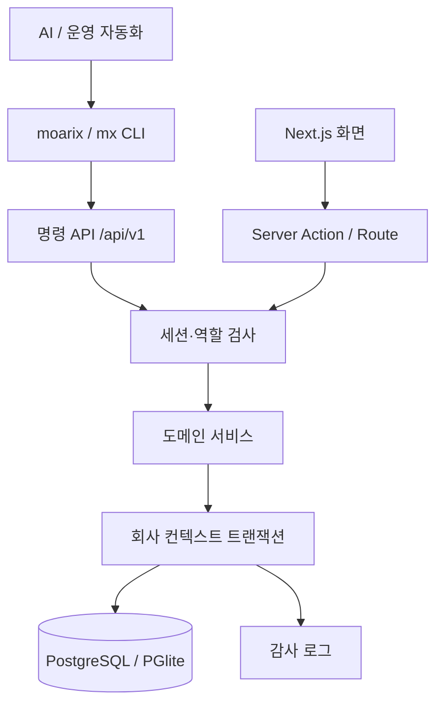

# MOARIX 아키텍처

## 설계 목표

MOARIX는 초기 운영 복잡도를 낮추기 위해 모듈형 모놀리스로 구성합니다. 업무 경계는 코드와 데이터 모델에서 분리하되, 문서 승인·재고 반영·감사 기록처럼 원자성이 필요한 작업은 하나의 데이터베이스 트랜잭션으로 처리합니다.

## 요청 흐름

프록시는 세션 쿠키가 없는 보호 경로를 조기에 로그인 화면으로 보냅니다. 실제 권한 검사는 모든 서버 작업에서 다시 수행하므로 프록시만 신뢰하지 않습니다.

## 모듈 경계

| 모듈 | 책임 | 핵심 불변식 |
|---|---|---|
| 인증·권한 | 로그인, 세션, 역할 | 원문 토큰 미저장, 서버 권한 재검사 |
| 자동화 API | API 토큰, capability, 명령 라우팅 | 역할·scope 교집합, 쓰기 멱등성, 하드 삭제 미노출 |
| 기준정보 | 거래처, 품목, 창고 | 회사 내 코드 고유 |
| 업무 문서 | 견적·수주·발주·청구 | 허용된 상태 전이만 가능 |
| 재고 | 잔량과 변동 원장 | 음수·과예약 금지, 원장 수정 금지 |
| 사업장·자산 | 현장, Stratus 노드·네트워크·VM과 라이선스 | 회사·고객·사업장 복합 참조, FT VM 자원 정책 |
| 지원계약 | 고객 지원 의무와 벤더 백계약, 개정 이력 | 한 자산·계약 범위당 현재 개정 1개, 과거 개정 불변 |
| 정기점검 | 점검 일정, 체크리스트 결과와 다음 점검 | 허용 상태 전이, 완료 결과 불변, 자원 비율 범위 |
| 서비스 | 내부·외부 케이스, SLA, 워처, 활동과 첨부 참조 | 고객·자산 일치, 원자 번호 할당, 활동·첨부 이력 불변 |
| 운행일지 | 방문 목적·거리·차량·비용과 고객/사업장/케이스 연결 | 초안만 수정, 낙관적 버전, 작성자 본인 승인 금지, 무효 사유 필수 |
| 보고서 | 재무·재고·지원·점검 집계 | 원장 데이터에서 재계산 |
| 감사 | 누가 무엇을 변경했는지 기록 | UPDATE/DELETE 금지 |

## 멀티테넌시

업무 테이블은 `company_id`를 복합 외래키와 인덱스에 포함합니다. 서비스는 `withCompany()` 트랜잭션에서 `app.current_company_id`를 설정하며, PostgreSQL에서는 `FORCE ROW LEVEL SECURITY` 정책이 다른 회사 행을 차단합니다. 운영 앱은 DB 소유자와 분리된 `NOSUPERUSER NOBYPASSRLS` 역할로만 접속하고, CI가 실제 PostgreSQL에서 조회·수정·삽입 격리를 검사합니다.

인증에 필요한 `users`, `companies`, `company_members`, `sessions`, `api_tokens`는 전역 테이블이지만 RLS를 강제합니다. 로그인·세션/API 토큰 복원과 세션 생성·갱신·폐기는 스키마를 고정한 최소 `SECURITY DEFINER` 함수로 제한합니다. 앱 역할은 세션/API 토큰 테이블을 직접 조회·변경할 수 없고 `schema_migrations`, 비밀번호 해시, 토큰 해시에도 직접 접근할 수 없습니다.

## AI 명령 API

- CLI는 브라우저 자동화나 직접 SQL 대신 `context → capabilities → commands` 계약을 사용합니다.
- API 토큰에는 회사·사용자·역할·scope·만료가 고정되며, 명령 실행 시 역할 permission과 토큰 scope를 모두 만족해야 합니다. 견적·운행일지의 고위험 상태 전이는 일반 `:write`와 분리된 `:approve` scope까지 요구합니다.
- capability는 실제 허용 operation, 입력 JSON Schema, dry-run·멱등성 정책을 기계 판독 가능한 JSON으로 반환합니다.
- 쓰기는 `Idempotency-Key`를 토큰별로 예약하고 요청 해시가 같은 완료 결과만 재생합니다. 키 재사용 충돌과 처리 중 중복 실행은 거부합니다.
- dry-run은 인증·scope·역할·JSON Schema를 검증하지만 DB 상태 기반 업무 규칙은 실제 반영 직전에 다시 검사합니다.
- 삭제 명령은 공개하지 않습니다. 자산 퇴역, 견적 취소, 케이스 종료, 운행일지 무효처럼 감사 가능한 상태 전이를 사용합니다.
- 사람용 Asset ID·케이스/견적/점검/운행 번호는 정확 일치만 허용하고 복수 일치는 UUID 입력을 요구합니다.

## Stratus 자산·지원 모델

- `assets`는 고객·사업장과 제품/운영 프로필을 보존하는 자산 루트입니다.
- `asset_nodes`, `asset_network_interfaces`, `asset_virtual_machines`는 노드·A-Link/BMC/업무망·VM 토폴로지를 같은 자산 복합 외래키로 제한합니다.
- `asset_support_contracts`는 고객 계약과 벤더 백계약을 분리하고 새 개정 생성 방식으로 이력을 보존합니다.
- `asset_licenses`는 계약과 별도 만료 축이며 전체 제품 키 대신 12자 이하 식별 힌트만 저장합니다.
- `inspection_check_items`는 점검 시작 시 생성되고 완료·조치 필요·취소 이후 변경/삭제할 수 없습니다.
- 자산 퇴역과 새 케이스·점검·토폴로지 등록은 자산 행 잠금으로 경합해 퇴역 이후 작업 생성을 막습니다.

## 금액과 재고

- 모든 금액·수량은 부동소수점 대신 `numeric`과 Decimal.js를 사용합니다.
- 문서 품목에는 작성 시점의 품목명·단위·가격 스냅샷을 저장합니다.
- 재고 잔량 변경과 변동 원장 기록은 같은 트랜잭션입니다.
- 입출고 요청은 멱등 키가 같으면 한 번만 반영됩니다.
- 확정 문서와 재고/감사 원장은 직접 수정하지 않고 후속 역분개 방식으로 확장합니다.

## 서비스 케이스

- 케이스 본문, 고객 담당자, Entitlement, 자산과 외부 지원 참조를 하나의 상세 화면에서 조회합니다.
- 업무 큐는 진행 건, 연체 여부, 심각도, 처리 기한과 다음 조치일 순으로 정렬합니다.
- 고객·지원사 회신, 내부 작업 메모, 상태 변경은 `service_case_activities`에 추가 전용으로 기록합니다.
- 상태 변경, 활동 이벤트와 감사 로그는 같은 회사 컨텍스트 트랜잭션에서 커밋합니다.
- 대용량 진단 파일은 PostgreSQL에 저장하지 않습니다. 현재는 HTTPS 저장소 링크와 파일 메타데이터만 기록하며, 실제 업로드는 별도 비공개 객체 저장소를 사용합니다.
- 인증 포털의 iframe은 공급자 CSP·세션·서드파티 쿠키에 의존하므로 사용하지 않고 외부 원문 링크 또는 향후 API 동기화를 사용합니다.

## 인증 보안

- bcrypt 비용 12의 비밀번호 해시
- 256비트 무작위 불투명 세션 토큰
- 세션·API 토큰 원문은 DB에 저장하지 않고 HMAC 해시와 안전한 prefix만 저장
- API 토큰은 명시적 scope·만료·폐기·최근 사용 시각을 가짐
- 12시간 만료, 로그아웃 시 서버 폐기
- 이메일 HMAC 식별자로 15분 창에서 5회 실패 시 차단
- HttpOnly, SameSite=Lax, 운영 HTTPS Secure 쿠키
- CSP, HSTS, 프레임·MIME·리퍼러·권한 정책 헤더

## 배포

개발은 PGlite로 즉시 실행할 수 있습니다. 운영은 PostgreSQL을 권장하며, 일회성 `migrate` 작업이 DB 소유자 권한으로 순서가 보장된 SQL 마이그레이션을 적용한 뒤 제한된 앱 역할의 서버 컨테이너를 시작합니다. 애플리케이션은 상태를 DB에 두므로 여러 인스턴스로 확장할 수 있습니다.

PGlite는 단일 인스턴스 로컬 평가용입니다. 다중 프로세스·고가용성·백업 요구가 있는 환경에서 사용하지 않습니다.
