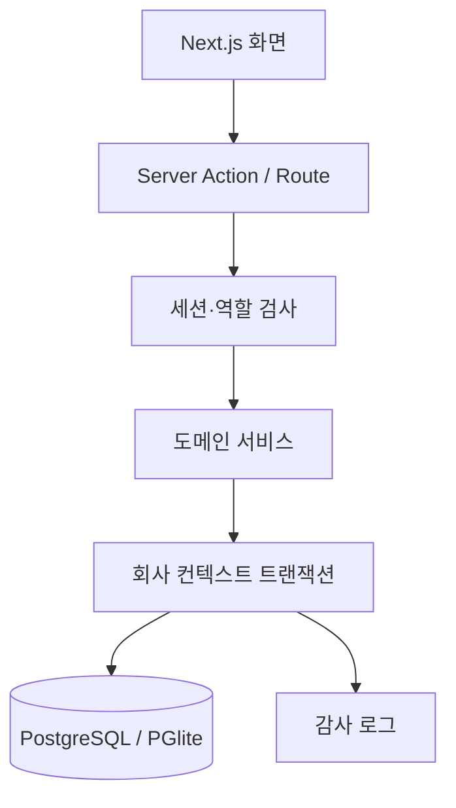

# MOARIX 아키텍처

## 설계 목표

MOARIX는 초기 운영 복잡도를 낮추기 위해 모듈형 모놀리스로 구성합니다. 업무 경계는 코드와 데이터 모델에서 분리하되, 문서 승인·재고 반영·감사 기록처럼 원자성이 필요한 작업은 하나의 데이터베이스 트랜잭션으로 처리합니다.

## 요청 흐름

프록시는 세션 쿠키가 없는 보호 경로를 조기에 로그인 화면으로 보냅니다. 실제 권한 검사는 모든 서버 작업에서 다시 수행하므로 프록시만 신뢰하지 않습니다.

## 모듈 경계

| 모듈 | 책임 | 핵심 불변식 |
|---|---|---|
| 인증·권한 | 로그인, 세션, 역할 | 원문 토큰 미저장, 서버 권한 재검사 |
| 기준정보 | 거래처, 품목, 창고 | 회사 내 코드 고유 |
| 업무 문서 | 견적·수주·발주·청구 | 허용된 상태 전이만 가능 |
| 재고 | 잔량과 변동 원장 | 음수·과예약 금지, 원장 수정 금지 |
| 사업장·자산 | 현장, Stratus 장비와 지원 계약 | 회사·고객·사업장 복합 참조 무결성 |
| 정기점검 | 점검 일정, 체크 결과와 다음 점검 | 허용 상태 전이와 자원 비율 범위 |
| 서비스 | 내부·외부 케이스, SLA, 활동과 첨부 참조 | 고객·자산 일치, 원자 번호 할당, 활동·첨부 이력 불변 |
| 보고서 | 재무·재고·지원·점검 집계 | 원장 데이터에서 재계산 |
| 감사 | 누가 무엇을 변경했는지 기록 | UPDATE/DELETE 금지 |

## 멀티테넌시

업무 테이블은 `company_id`를 복합 외래키와 인덱스에 포함합니다. 서비스는 `withCompany()` 트랜잭션에서 `app.current_company_id`를 설정하며, PostgreSQL에서는 `FORCE ROW LEVEL SECURITY` 정책이 다른 회사 행을 차단합니다. 운영 앱은 DB 소유자와 분리된 `NOSUPERUSER NOBYPASSRLS` 역할로만 접속하고, CI가 실제 PostgreSQL에서 조회·수정·삽입 격리를 검사합니다.

인증에 필요한 `users`, `companies`, `company_members`, `sessions`는 전역 테이블입니다. 이 테이블을 읽는 쿼리는 회사 식별자를 명시하고, 관리 화면의 권한 검사를 먼저 수행합니다.

## 금액과 재고

- 모든 금액·수량은 부동소수점 대신 `numeric`과 Decimal.js를 사용합니다.
- 문서 품목에는 작성 시점의 품목명·단위·가격 스냅샷을 저장합니다.
- 재고 잔량 변경과 변동 원장 기록은 같은 트랜잭션입니다.
- 입출고 요청은 멱등 키가 같으면 한 번만 반영됩니다.
- 확정 문서와 재고/감사 원장은 직접 수정하지 않고 후속 역분개 방식으로 확장합니다.

## 서비스 케이스

- 케이스 본문, 고객 담당자, Entitlement, 자산과 외부 지원 참조를 하나의 상세 화면에서 조회합니다.
- 업무 큐는 진행 건, 연체 여부, 심각도, 처리 기한과 다음 조치일 순으로 정렬합니다.
- 고객·지원사 회신, 내부 작업 메모, 상태 변경은 `service_case_activities`에 추가 전용으로 기록합니다.
- 상태 변경, 활동 이벤트와 감사 로그는 같은 회사 컨텍스트 트랜잭션에서 커밋합니다.
- 대용량 진단 파일은 PostgreSQL에 저장하지 않습니다. 현재는 HTTPS 저장소 링크와 파일 메타데이터만 기록하며, 실제 업로드는 별도 비공개 객체 저장소를 사용합니다.
- 인증 포털의 iframe은 공급자 CSP·세션·서드파티 쿠키에 의존하므로 사용하지 않고 외부 원문 링크 또는 향후 API 동기화를 사용합니다.

## 인증 보안

- bcrypt 비용 12의 비밀번호 해시
- 256비트 무작위 불투명 세션 토큰
- DB에는 HMAC 해시만 저장
- 12시간 만료, 로그아웃 시 서버 폐기
- 이메일 HMAC 식별자로 15분 창에서 5회 실패 시 차단
- HttpOnly, SameSite=Lax, 운영 HTTPS Secure 쿠키
- CSP, HSTS, 프레임·MIME·리퍼러·권한 정책 헤더

## 배포

개발은 PGlite로 즉시 실행할 수 있습니다. 운영은 PostgreSQL을 권장하며, 컨테이너 시작 시 순서가 보장된 SQL 마이그레이션을 자동 적용합니다. 애플리케이션은 상태를 DB에 두므로 여러 인스턴스로 확장할 수 있습니다.

PGlite는 단일 인스턴스 로컬 평가용입니다. 다중 프로세스·고가용성·백업 요구가 있는 환경에서 사용하지 않습니다.
